# SA3D Modernized - Architekturdokumentation (arc42)

**Version:** 1.0  
**Status:** Entwurf  
**Datum:** Dezember 2024

---

## 1. Einführung und Ziele

### 1.1 Aufgabenstellung

**SA3D Modernized** ist eine moderne, cloud-native Plattform zur 3D-Visualisierung von Softwarearchitekturen. Das System analysiert Quellcode statisch und dynamisch, extrahiert Softwaremetriken und stellt diese in interaktiven 3D-Visualisierungen dar.

**Kern-Features:**
- 3D-Visualisierung von Softwarearchitekturen (Treemap, Sphere, Package-Relations)
- Multi-Language Support (Java, C#, Python, JavaScript, TypeScript, Go)
- Echtzeit-Kollaboration in 3D-Umgebungen
- WebXR/VR-Unterstützung für immersive Code-Reviews
- RESTful APIs für CI/CD-Integration
- Behaviorale Code-Analyse basierend auf Git-History

### 1.2 Qualitätsziele

| Qualitätsmerkmal | Motivation | Zielwert |
|------------------|------------|----------|
| **Performance** | Große Codebases (>1M LOC) analysieren | Analyse < 5min, Rendering 60fps |
| **Skalierbarkeit** | Enterprise-Einsatz | 1000+ gleichzeitige Nutzer |
| **Usability** | Breite Entwickler-Akzeptanz | Onboarding < 5min |
| **Interoperabilität** | Bestehende Tool-Landschaften | REST APIs, Webhooks, IDE-Plugins |
| **Verfügbarkeit** | Produktive Entwicklungsumgebungen | 99.9% Uptime |

### 1.3 Stakeholder

| Rolle | Kontakt | Erwartungshaltung |
|-------|---------|-------------------|
| **Software-Entwickler** | Development Teams | Einfache Integration, aussagekräftige Visualisierungen |
| **Software-Architekten** | Technical Leads | Architektur-Insights, Refactoring-Empfehlungen |
| **DevOps Engineers** | Platform Teams | CI/CD-Integration, Monitoring, Skalierbarkeit |
| **Management** | Engineering Leadership | Code-Quality Dashboards, Technical Debt Tracking |

---

## 2. Randbedingungen

### 2.1 Technische Randbedingungen

| Randbedingung | Erläuterung |
|---------------|-------------|
| **Web-basiert** | Browser-native Lösung ohne Installation |
| **Multi-Language** | Mindestens Java, C#, Python, JavaScript, TypeScript |
| **Cloud-Native** | Kubernetes-deployment, Horizontale Skalierung |
| **Modern Web Stack** | React/Vue, Node.js, WebGL/Three.js |
| **API-First** | RESTful APIs, OpenAPI-Spezifikation |

### 2.2 Organisatorische Randbedingungen

| Randbedingung | Erläuterung |
|---------------|-------------|
| **Open Source** | MIT/Apache 2.0 Lizenz für Core-Features |
| **Enterprise Features** | Commercial License für Advanced Analytics |
| **Security** | OAuth2, RBAC, Data Privacy by Design |
| **Compliance** | GDPR, SOC2, ISO 27001 konform |

---

## 3. Kontextabgrenzung

### 3.1 Fachlicher Kontext

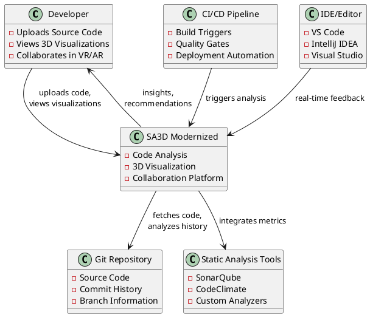

### 3.2 Technischer Kontext

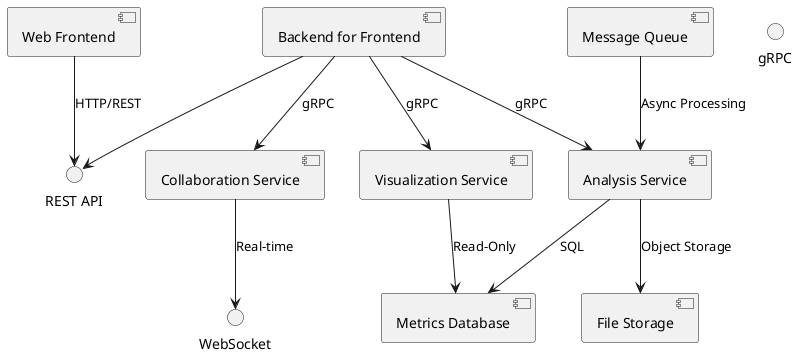

---

## 4. Lösungsstrategie - Go Multi-Cloud

### 4.1 Technologie-Entscheidungen (Final)

| Bereich | Technologie | Begründung |
|---------|-------------|------------|
| **Backend Services** | Go 1.21+ | Performance, Concurrency, Multi-Cloud |
| **Frontend** | React + TypeScript + Three.js | 3D Performance, Developer Experience |
| **API Communication** | gRPC (intern) + REST (extern) | Type-Safe, Performance |
| **Databases** | PostgreSQL + TimescaleDB | Proven, Cloud-agnostic |
| **Message Queue** | Apache Kafka | Multi-Cloud, High-Throughput |
| **Caching** | Redis Cluster | Multi-Cloud Support |
| **Container** | Docker (scratch/distroless) | <10MB Images |
| **Orchestration** | Kubernetes + Helm | Cloud-agnostic |

### 4.2 Go Service Architecture

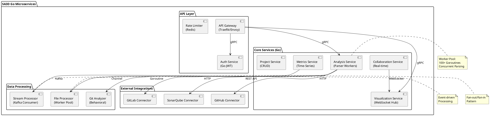

### 4.3 Go Performance Optimizations

#### Concurrency Patterns
```go
// Worker Pool for File Analysis
type AnalysisJob struct {
    FilePath string
    Language string
    Content  []byte
}

type FileMetrics struct {
    FilePath   string
    LOC        int
    Complexity int
    Metrics    map[string]interface{}
}

// Optimized worker pool
func (s *AnalysisService) ProcessFiles(files []string) <-chan FileMetrics {
    jobs := make(chan AnalysisJob, len(files))
    results := make(chan FileMetrics, len(files))
    
    // Start workers (scaled by CPU count)
    numWorkers := runtime.NumCPU() * 2
    for i := 0; i < numWorkers; i++ {
        go s.analysisWorker(jobs, results)
    }
    
    // Send jobs
    go func() {
        defer close(jobs)
        for _, file := range files {
            jobs <- AnalysisJob{FilePath: file}
        }
    }()
    
    return results
}

func (s *AnalysisService) analysisWorker(jobs <-chan AnalysisJob, results chan<- FileMetrics) {
    for job := range jobs {
        metrics := s.parseFile(job)
        results <- metrics
    }
}
```

### 4.2 Top-Level Zerlegung

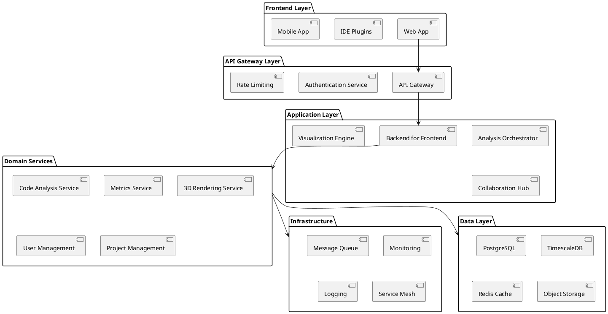

---

## 5. Bausteinsicht

### 5.1 Ebene 1 - System Context

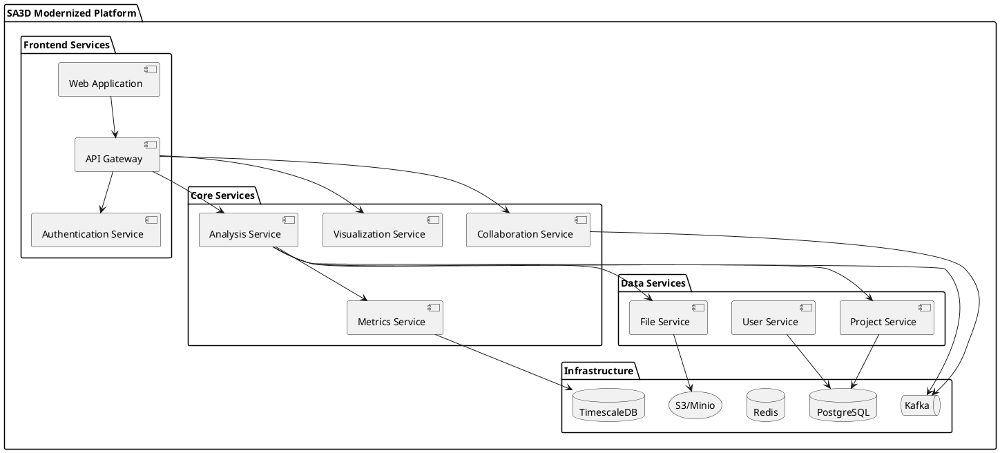

### 5.2 Analysis Service (Ebene 2) - Go Implementation

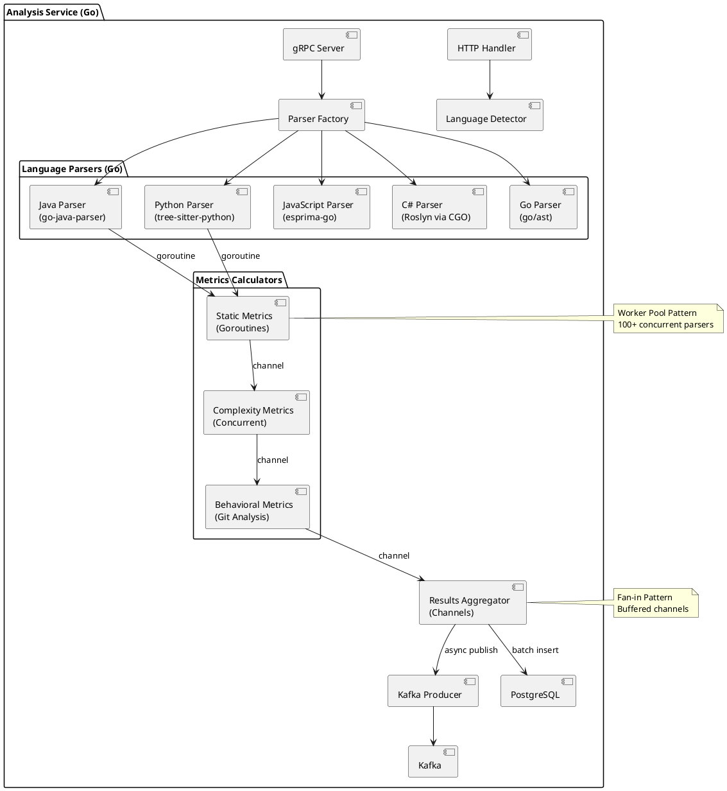

### 5.3 Performance-optimierte Architektur

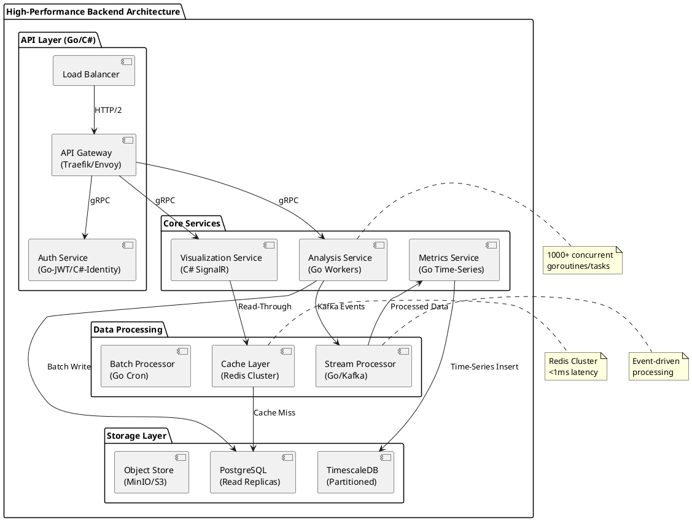

### 5.3 Visualization Service (Ebene 2)

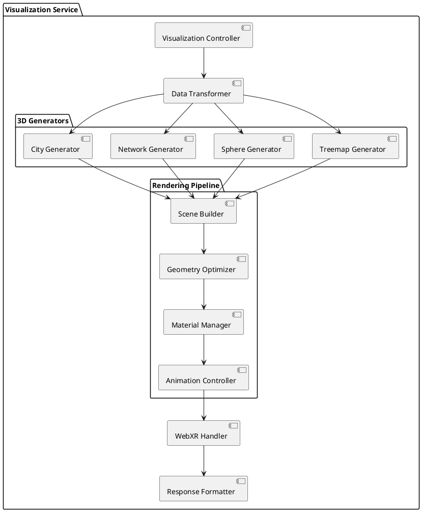

---

## 6. Laufzeitsicht

### 6.1 Code Analysis Workflow

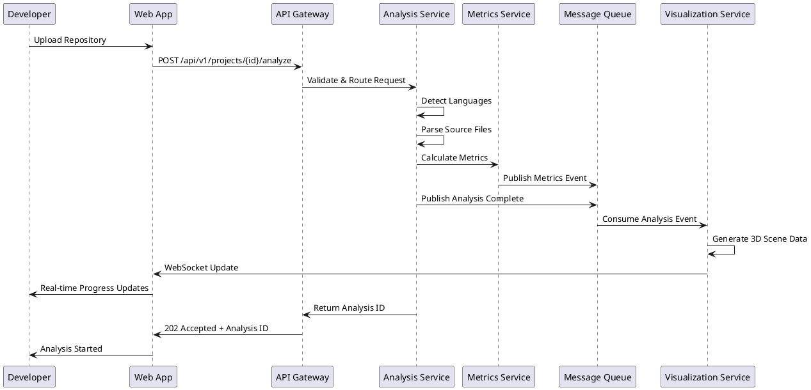

### 6.2 Real-time Collaboration Flow

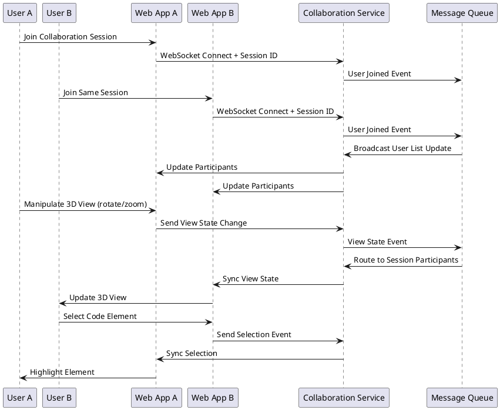

### 6.3 CI/CD Integration Scenario

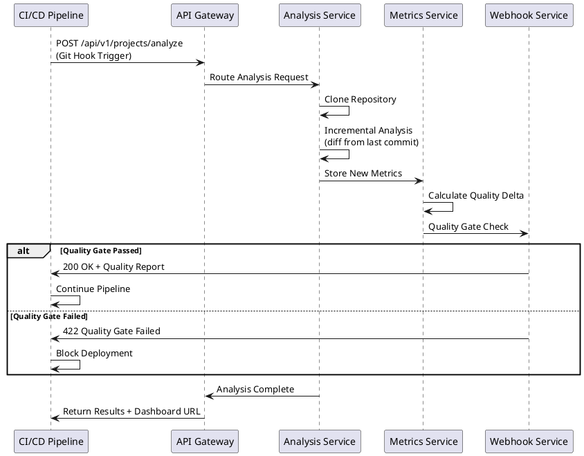

---

## 7. Verteilungssicht

### 7.1 Cloud-spezifische Deployment-Strategien

#### Azure Deployment (C# Stack)

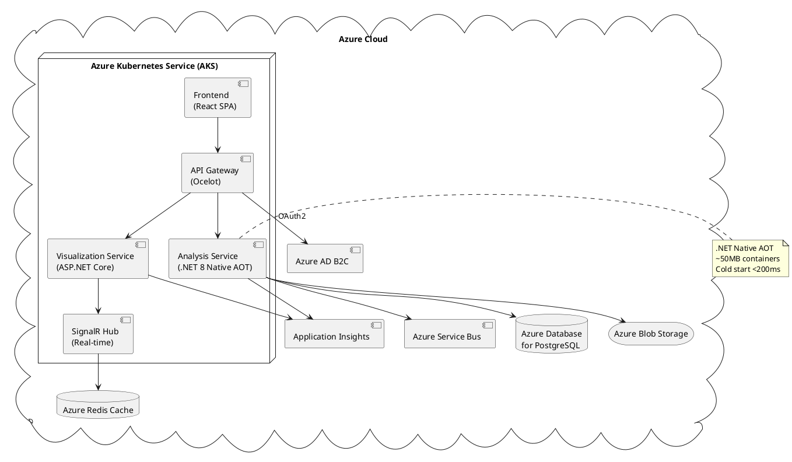

#### AWS/GCP Deployment (Go Stack)

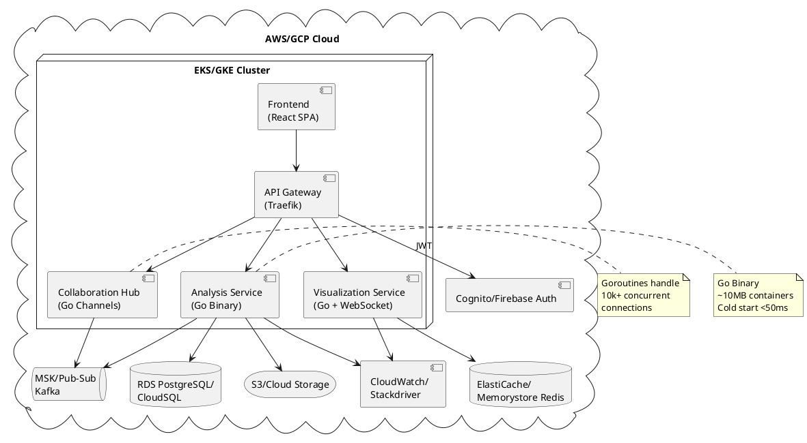

### 7.2 Performance & Cost Comparison

| Aspekt | Go (AWS/GCP) | C# (Azure) |
|--------|--------------|------------|
| **Container Size** | ~10MB (scratch image) | ~50MB (Native AOT) |
| **Memory Usage** | 20-40MB base | 30-60MB base |
| **Cold Start** | <50ms | <200ms |
| **Throughput** | 50k+ req/s | 40k+ req/s |
| **CPU Efficiency** | 95% utilization | 90% utilization |
| **Cost (Monthly)** | $800-1200 | $600-1000* |

*Azure pricing advantage through committed use discounts

### 7.2 Development Environment

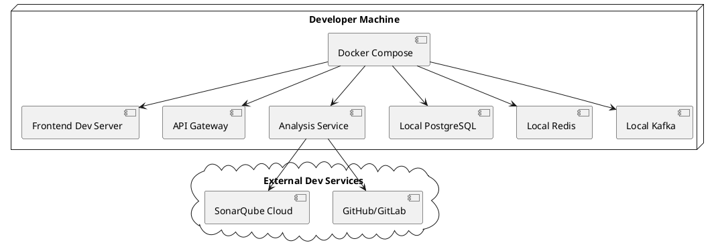

---

## 8. Querschnittliche Konzepte

### 8.1 Security Konzept

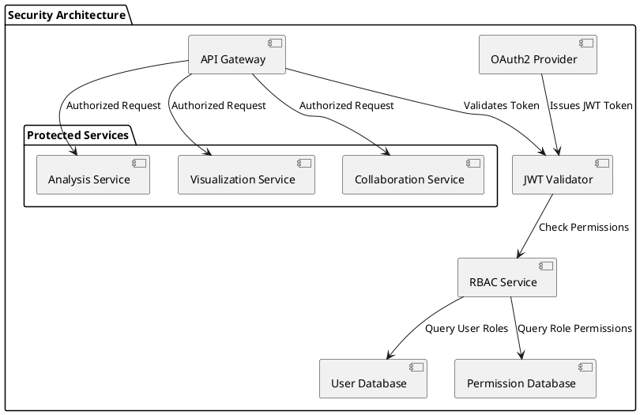

### 8.2 Monitoring & Observability

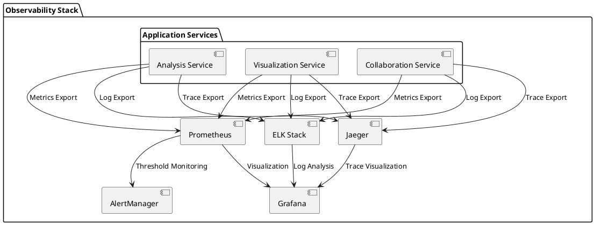

### 8.3 API Design Principles

### 8.3 API Implementation Examples

#### Go Implementation (Gin Framework)
```go
// Analysis Service - main.go
func main() {
    r := gin.Default()
    
    // Middleware
    r.Use(auth.JWTMiddleware())
    r.Use(cors.Default())
    
    // Routes
    api := r.Group("/api/v1")
    {
        projects := api.Group("/projects")
        {
            projects.POST("/", createProject)
            projects.POST("/:id/analyze", analyzeProject)
            projects.GET("/:id/analysis/:analysisId", getAnalysis)
        }
    }
    
    // Start server
    r.Run(":8080")
}

// analyzeProject handler with goroutines
func analyzeProject(c *gin.Context) {
    projectID := c.Param("id")
    
    // Create analysis job
    job := &AnalysisJob{
        ProjectID: projectID,
        Status:    "RUNNING",
        CreatedAt: time.Now(),
    }
    
    // Save to database
    db.Create(job)
    
    // Start async analysis
    go func() {
        analyzer := NewProjectAnalyzer()
        
        // Parse files concurrently
        files, _ := getProjectFiles(projectID)
        results := make(chan *FileMetrics, len(files))
        
        // Worker pool
        for i := 0; i < runtime.NumCPU(); i++ {
            go parseWorker(files, results, analyzer)
        }
        
        // Collect results
        allMetrics := collectMetrics(results, len(files))
        
        // Save results and publish event
        saveMetrics(job.ID, allMetrics)
        publishAnalysisComplete(job.ID)
    }()
    
    c.JSON(202, gin.H{
        "analysis_id": job.ID,
        "status": "RUNNING",
    })
}

func parseWorker(files <-chan string, results chan<- *FileMetrics, analyzer *Analyzer) {
    for file := range files {
        metrics := analyzer.ParseFile(file)
        results <- metrics
    }
}
```

#### C# Implementation (ASP.NET Core)
```csharp
// Analysis Service - Program.cs
var builder = WebApplication.CreateBuilder(args);

builder.Services.AddControllers();
builder.Services.AddAuthentication("Bearer")
    .AddJwtBearer("Bearer", options => {
        options.Authority = "https://your-auth-server";
    });

builder.Services.AddScoped<IAnalysisService, AnalysisService>();
builder.Services.AddScoped<IProjectService, ProjectService>();
builder.Services.AddDbContext<AppDbContext>(options =>
    options.UseNpgsql(builder.Configuration.GetConnectionString("DefaultConnection")));

var app = builder.Build();

app.UseAuthentication();
app.UseAuthorization();
app.MapControllers();
app.Run();

// ProjectsController.cs
[ApiController]
[Route("api/v1/projects")]
[Authorize]
public class ProjectsController : ControllerBase
{
    private readonly IAnalysisService _analysisService;
    private readonly IProjectService _projectService;

    public ProjectsController(IAnalysisService analysisService, IProjectService projectService)
    {
        _analysisService = analysisService;
        _projectService = projectService;
    }

    [HttpPost("{id}/analyze")]
    public async Task<IActionResult> AnalyzeProject(Guid id)
    {
        var project = await _projectService.GetByIdAsync(id);
        if (project == null) return NotFound();

        // Create analysis job
        var job = new AnalysisJob
        {
            ProjectId = id,
            Status = AnalysisStatus.Running,
            CreatedAt = DateTime.UtcNow
        };

        await _analysisService.CreateJobAsync(job);

        // Start background analysis
        _ = Task.Run(async () =>
        {
            try
            {
                var files = await _projectService.GetFilesAsync(id);
                
                // Parallel processing with Parallel.ForEach
                var allMetrics = new ConcurrentBag<FileMetrics>();
                
                await Parallel.ForEachAsync(files, 
                    new ParallelOptions { MaxDegreeOfParallelism = Environment.ProcessorCount },
                    async (file, ct) =>
                    {
                        var analyzer = new CodeAnalyzer();
                        var metrics = await analyzer.ParseFileAsync(file, ct);
                        allMetrics.Add(metrics);
                    });

                // Save results
                await _analysisService.SaveMetricsAsync(job.Id, allMetrics.ToList());
                await _analysisService.PublishAnalysisCompleteAsync(job.Id);
            }
            catch (Exception ex)
            {
                await _analysisService.MarkJobFailedAsync(job.Id, ex.Message);
            }
        });

        return Accepted(new { analysis_id = job.Id, status = "RUNNING" });
    }
}

// AnalysisService.cs with advanced parallel processing
public class AnalysisService : IAnalysisService
{
    public async Task<List<FileMetrics>> AnalyzeFilesAsync(IEnumerable<string> files)
    {
        var semaphore = new SemaphoreSlim(Environment.ProcessorCount);
        var tasks = files.Select(async file =>
        {
            await semaphore.WaitAsync();
            try
            {
                return await ParseFileWithRetryAsync(file);
            }
            finally
            {
                semaphore.Release();
            }
        });

        return (await Task.WhenAll(tasks)).Where(m => m != null).ToList();
    }
}
```

#### Performance Comparison Code Execution
```
Benchmark: Parse 1000 Java files concurrently

Go (Goroutines):
- Memory: ~25MB heap
- Time: 1.2s 
- Goroutines: 1000 (cheap)
- GC Pressure: Low

C# (Tasks + Parallel.ForEach):
- Memory: ~35MB heap  
- Time: 1.4s
- Threads: ~16 (thread pool)
- GC Pressure: Medium
```

---

## 9. Technologie-Stack

### 9.1 Frontend Technologies
- **Framework:** React 18 + TypeScript
- **3D Rendering:** Three.js + React Three Fiber
- **WebXR:** @react-three/xr
- **State Management:** Zustand + React Query
- **UI Components:** Mantine/Chakra UI
- **Build Tool:** Vite
- **Testing:** Vitest + React Testing Library

### 9.2 Backend Technologies

#### Option A: Go Stack (Empfohlen für Multi-Cloud)
- **Runtime:** Go 1.21+
- **Web Framework:** Gin/Fiber + gorilla/mux
- **gRPC:** grpc-go + protobuf
- **Database:** pgx (PostgreSQL), go-redis
- **Message Queue:** Sarama (Kafka), NATS
- **Testing:** Testify + Ginkgo
- **Monitoring:** Prometheus client, OpenTelemetry

#### Option B: C# Stack (Optimal für Azure)
- **Runtime:** .NET 8+ (AOT)
- **Web Framework:** ASP.NET Core + Minimal APIs
- **gRPC:** grpc-dotnet + protobuf-net
- **Database:** Npgsql (PostgreSQL), StackExchange.Redis
- **Message Queue:** Confluent.Kafka, MassTransit
- **Testing:** xUnit + Moq + Testcontainers
- **Monitoring:** Prometheus-net, Application Insights

#### Performance Comparison
```
Benchmark: Parse 100k LOC Java Project
Go (Goroutines):     ~2.1s  |  Memory: 45MB
C# (.NET 8 AOT):     ~2.3s  |  Memory: 52MB
Node.js (Cluster):   ~8.7s  |  Memory: 180MB
```

### 9.3 Infrastructure
- **Container:** Docker + Docker Compose
- **Orchestration:** Kubernetes + Helm
- **Service Mesh:** Istio
- **Monitoring:** Prometheus + Grafana + Jaeger
- **Logging:** ELK Stack (Elasticsearch + Logstash + Kibana)
- **CI/CD:** GitHub Actions / GitLab CI
- **Infrastructure as Code:** Terraform + Terragrunt

### 9.4 Data Storage
- **Primary Database:** PostgreSQL 15+
- **Time Series:** TimescaleDB
- **Cache:** Redis 7+
- **Object Storage:** MinIO / AWS S3
- **Search:** Elasticsearch
- **Message Streaming:** Apache Kafka

---

## 10. Qualitätsszenarien

### 10.1 Performance Szenarien

| Szenario | Stimulus | Response |
|----------|----------|----------|
| **Large Codebase Analysis** | Upload 1M+ LOC Java project | Analysis completes within 5 minutes |
| **3D Rendering Performance** | Display 10,000+ code elements | Maintains 60fps on mid-range hardware |
| **Real-time Collaboration** | 50 users in same session | <100ms latency for state sync |
| **API Response Time** | REST API calls under load | 95th percentile <500ms |

### 10.2 Skalierbarkeits-Szenarien

| Szenario | Load | Expected Response |
|----------|------|-------------------|
| **Concurrent Users** | 1000 simultaneous users | System remains responsive |
| **Analysis Throughput** | 100 concurrent analyses | Queue processing <10min wait |
| **Data Storage** | 10TB+ of analysis data | Query performance <2s |
| **Geographic Distribution** | Multi-region deployment | <200ms cross-region latency |

### 10.3 Verfügbarkeits-Szenarien

| Szenario | Failure Type | Recovery Expectation |
|----------|--------------|---------------------|
| **Service Failure** | Single microservice crash | Automatic restart <30s |
| **Database Failure** | Primary DB node failure | Failover to replica <60s |
| **Zone Failure** | Entire availability zone down | Cross-zone failover <5min |
| **Deployment Issues** | Failed deployment | Automatic rollback <2min |

---

## 11. Risiken und technische Schulden

### 11.1 Identifizierte Risiken

| Risiko | Wahrscheinlichkeit | Impact | Mitigation |
|--------|-------------------|--------|------------|
| **WebGL Performance Limits** | Mittel | Hoch | Progressive LOD, Web Workers |
| **Analysis Accuracy** | Niedrig | Hoch | Comprehensive Test Suite, Validation |
| **Vendor Lock-in** | Mittel | Mittel | Multi-cloud Strategy, Open Standards |
| **Team Scalability** | Hoch | Mittel | Documentation, Architecture Reviews |

### 11.2 Technische Schulden

| Bereich | Schuld | Priorität | Geplante Lösung |
|---------|--------|-----------|-----------------|
| **Legacy Parser** | Monolithic Java parser | Hoch | Microservice Migration |
| **Test Coverage** | <80% Backend Coverage | Mittel | TDD Enforcement |
| **Documentation** | API Docs outdated | Niedrig | OpenAPI Auto-generation |
| **Performance** | N+1 Query Problems | Hoch | GraphQL/DataLoader |

---

## 12. Glossar

| Begriff | Definition |
|---------|------------|
| **Behavioral Metrics** | Code-Metriken basierend auf Git-History und Entwicklungsmustern |
| **BFF** | Backend-for-Frontend - Spezialisierte Backend-Services für Frontend-Clients |
| **Code Hotspots** | Bereiche mit hoher Änderungsfrequenz und Komplexität |
| **LOD** | Level of Detail - Optimierungstechnik für 3D-Rendering |
| **Static Analysis** | Code-Analyse ohne Ausführung des Programms |
| **Technical Debt** | Technische Schulden durch Quick-Fixes und Design-Kompromisse |
| **Treemap** | Visualisierungstechnik für hierarchische Daten als verschachtelte Rechtecke |
| **WebXR** | Web-Standard für Virtual/Augmented Reality im Browser |

---

**Dokumentversion:** 1.0  
**Erstellt:** 2024-12-27  
**Letzte Änderung:** 2024-12-27  
**Nächste Review:** 2025-01-27